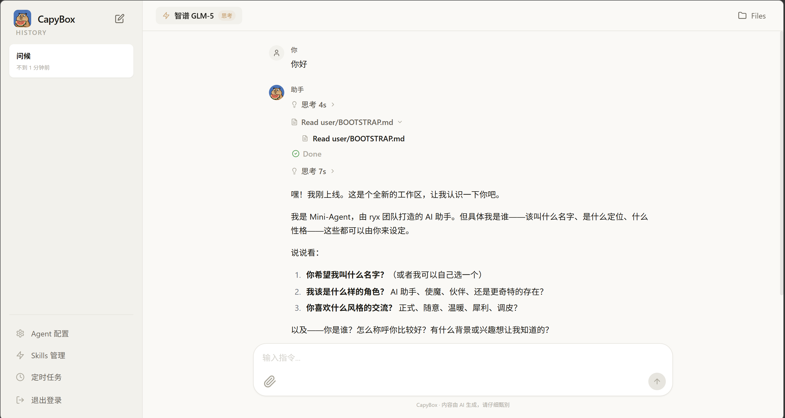
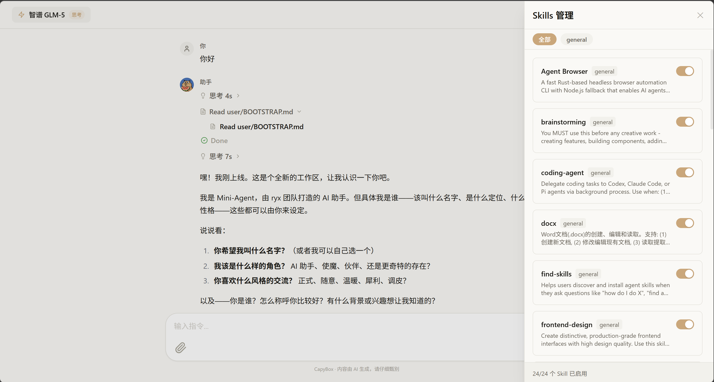
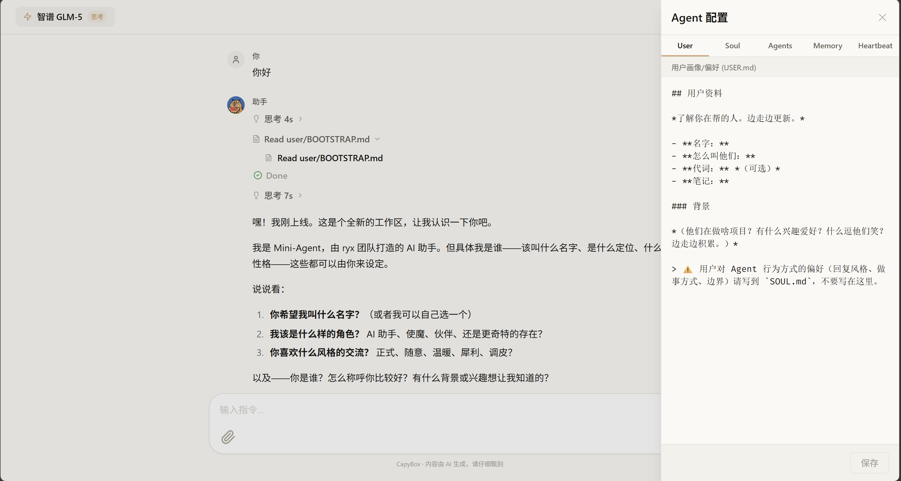
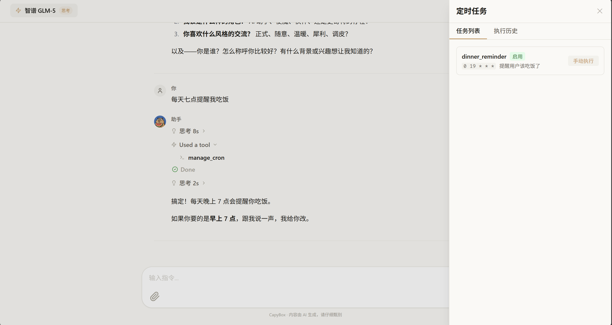
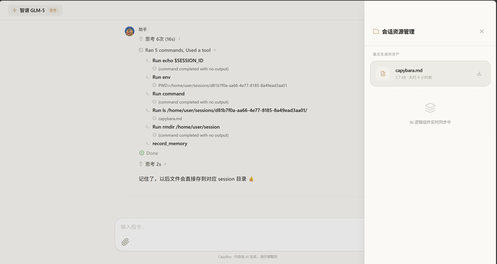
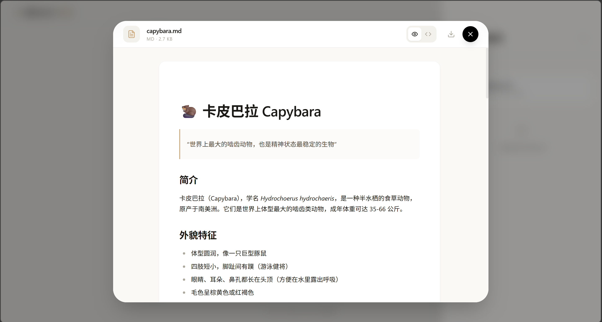

<div align="center">

# 🛁 OpenCapyBox

**你的 AI 助手住在安全的盒子里 — 沙箱隔离 · 记忆成长 · 技能可插拔 · 对小白友好**

```
   ╭━━━━━━━━━━━━╮
    ┃ OpenCapyBox┃
   ┃    ∩  ∩    ┃
   ┃   (◕ ᴥ ◕)  ┃
   ┃  ～～～～～  ┃
   ╰━━━━━━━━━━━━╯
```

[](https://www.python.org/)
[](https://www.typescriptlang.org/)
[](https://fastapi.tiangolo.com/)
[](https://react.dev/)
[](LICENSE)

[功能亮点](#-功能亮点) · [截图预览](#-截图预览) · [快速开始](#-快速开始) · [架构设计](#-架构设计) · [技能系统](#-技能系统) · [记忆系统](#-记忆系统) · [部署指南](#-部署指南) · [参与贡献](#-贡献指南)

**[English](README.md)**

</div>

---

## 项目简介

**OpenCapyBox** 是一个开源的全栈 AI 智能体平台。就像卡皮巴拉（水豚）安静地泡在水里一样，你的 AI 助手安全地住在沙箱容器中——帮你执行代码、处理文档、搜索网络、管理文件，同时不断积累记忆和学习新技能。

### 为什么是 OpenCapyBox？

| | 水豚的特质 | OpenCapyBox 的能力 |
|---|---|---|
| 🛁 | 泡在安全的水域里 | 每个用户一个 **OpenSandbox 沙箱**，完全隔离 |
| 🧠 | 记性好，认识所有朋友 | **分层记忆系统**（USER.md / MEMORY.md / SOUL.md），越用越懂你 |
| 🤝 | 万物皆朋友 | **多模型兼容**（Qwen / GLM / Kimi / DeepSeek / MiniMax），一键切换 |
| 🎒 | 什么都能背 | **40+ 可插拔技能**，官方技能一键启用，也能上传自定义 Skill |
| ⏰ | 定时活动，作息规律 | **Cron 定时任务**系统，AI 自主定期执行 |
| 🌐 | 悠闲但靠谱 | 全程沙箱隔离执行，**对小白用户友好**，所有操作前端可视 |

## ✨ 功能亮点

### 🔀 多模型热切换

通过 `models.yaml` 声明式注册，支持 Anthropic / OpenAI 双协议，无需改代码：

| 模型 | 协议 | 平台 | 特性 |
|------|------|------|------|
| Qwen3.5-plus | OpenAI | 阿里 DashScope | 思考链、多模态 |
| GLM-4.7 / GLM-5 | OpenAI | 阿里 DashScope | 思考链 |
| Kimi-2.5 | OpenAI | 阿里 DashScope | 思考链、多模态 |
| DeepSeek-V3.2 | OpenAI | 阿里 DashScope | 思考链、长上下文 |
| MiniMax-M2 | Anthropic | MiniMax | 原生思考 |

<details>
<summary>💡 想加新模型？在 <code>models.yaml</code> 里加一个条目就行（点击展开示例）</summary>

```yaml
  my-new-model:
    display_name: "My New Model"
    provider: openai              # openai 或 anthropic
    api_base: "https://api.example.com/v1"
    api_key: "${MY_API_KEY}"      # 引用 .env 中的环境变量
    model_name: "my-model-name"
    max_tokens: 32768
    reasoning_format: reasoning_content  # none / reasoning_content / anthropic_thinking
    reasoning_split: true
    enable_thinking: true
    supports_image: false
    enabled: true
    tags: [thinking]
```

完整配置说明见 [`models.yaml`](models.yaml) 文件头注释。

</details>

### 🛡️ 一用户一沙箱

- 每个用户分配独立的 **OpenSandbox** 容器
- 所有代码执行、文件操作、Shell 命令都在容器内完成
- 持久化存储挂载，数据不丢失
- 文件上传/下载/搜索全部通过沙箱代理，**小白用户无需关心底层**

### 🧠 会成长的记忆

| 文件 | 作用 | 通俗理解 |
|------|------|---------|
| `USER.md` | 用户画像 — 你的偏好、习惯 | "它记住了你喜欢什么" |
| `MEMORY.md` | 长期记忆 — 知识积累 | "它记住了你们聊过什么" |
| `SOUL.md` | 人格定义 — 语气和风格 | "它的性格是你塑造的" |

支持 **BM25 关键词 + 向量语义 + RRF 融合** 混合检索，越用越懂你。

### 🎨 对小白友好的界面

- **Claude 暖色调设计** — 柔和配色，内容优先
- **流式输出** — 思考过程、工具调用全程实时可视
- **Skill 管理器** — 分类标签，开关式启用/禁用
- **Agent 配置面板** — 直接编辑 SOUL.md / USER.md / MEMORY.md
- **定时任务看板** — 任务列表 + 执行历史一目了然
- **文件面板** — 沙箱内文件预览与一键下载

### ⏰ 定时任务

通过 `HEARTBEAT.md` 定义 Cron 任务，AI 助手自主定期执行：

- 前端可视化任务看板
- 支持手动触发 / 暂停
- 执行历史可追溯

### 🔧 丰富的内置工具

| 类别 | 工具 | 说明 |
|------|------|------|
| 📁 文件操作 | Read / Write / Edit | 沙箱内文件读写、字符串替换编辑 |
| 💻 Shell 执行 | Bash / BashOutput / BashKill | 容器内命令执行，支持后台进程 |
| 🔍 Web 搜索 | GLMSearch / BatchSearch | 博查搜索引擎，支持批量并行 |
| 🧠 记忆系统 | RecordDailyLog / SearchMemory | 分层持久化记忆 + 混合检索 |
| 📝 会话笔记 | SessionNote / RecallNote | 跨轮次上下文保持 |
| ⏰ 定时任务 | ManageCron | APScheduler 驱动的 Cron 管理 |
| 🎒 技能加载 | GetSkill | 40+ 可动态加载的专业技能 |
| 🔌 MCP 协议 | MCP Tools | 模型上下文协议工具集成 |

### 🔌 MCP 工具集成

OpenCapyBox 支持通过 [MCP（Model Context Protocol）](https://modelcontextprotocol.io/) 接入外部工具服务。配置文件位于 `src/agent/config/mcp.json`：

```json
{
  "mcpServers": {
    "my-mcp-server": {
      "description": "My MCP Server",
      "type": "stdio",
      "command": "npx",
      "args": ["-y", "@example/mcp-server"],
      "env": { "API_KEY": "your-key" },
      "disabled": false
    }
  }
}
```

- `type` 支持 `stdio`（本地进程）和 `streamable-http`（远程 HTTP）
- 设置 `"disabled": true` 可暂时停用某个 MCP 服务
- 环境变量 `MCP_CONFIG_PATH` 可自定义配置文件路径

## 📸 截图预览

### 主聊天界面

流式对话 + AI 思考过程实时展开，工具调用全程可视。



### Skill 管理器

分类标签筛选，开关式启用/禁用，轻松管理 40+ 官方技能。



### Agent 配置面板

直接编辑 SOUL.md / USER.md / MEMORY.md，塑造你的 AI 助手人格与记忆。



### 定时任务看板

任务列表 + 执行历史，支持手动触发和状态追踪。



### 文件面板

沙箱内文件一览，支持预览和下载 Agent 生成的产出物。



### 文件预览

Markdown 渲染预览，支持源码查看与一键下载。



## 🚀 快速开始

### 前置要求

- Python 3.10+
- Node.js 16+
- [uv](https://github.com/astral-sh/uv)（Python 包管理器）
- [OpenSandbox](https://github.com/alibaba/OpenSandbox)（可选，沙箱执行环境）

### 1. 克隆并安装

```bash
git clone https://github.com/RonaldJEN/OpenCapyBox.git
cd OpenCapyBox

# 安装 Python 依赖
uv sync

# 安装前端依赖
cd frontend && npm install && cd ..
```

### 2. 配置环境

```bash
cp .env.example .env
```

编辑 `.env`，至少配置：

```bash
# === 必需 ===
LLM_API_KEY=your-dashscope-key           # 阿里 DashScope 统一密钥
SIMPLE_AUTH_USERS=demo:demo123           # 登录用户（格式 user:pass,user2:pass2）

# === OpenSandbox（可选） ===
SANDBOX_DOMAIN=localhost:8080
SANDBOX_API_KEY=your-sandbox-key

# === 其他（均有默认值） ===
# DATABASE_URL=sqlite:///./data/database/open_capy_box.db
# AGENT_MAX_STEPS=100
# AGENT_TOKEN_LIMIT=200000
```

### 3. 启动服务

```bash
# 启动后端（端口 8000）
uv run uvicorn src.api.main:app --reload --port 8000

# 新终端，启动前端（端口 3000）
cd frontend && npm run dev
```

打开 http://localhost:3000，使用 `demo` / `demo123` 登录。

### Docker 一键部署

```bash
cd deploy/docker

# 编辑环境变量
cp ../../.env.example ../../.env
# 编辑 .env 填入 API Key

# 启动
docker-compose up -d

# 查看日志
docker-compose logs -f
```

## 🏗️ 架构设计

### AG-UI 协议

OpenCapyBox 采用 **AG-UI（Agent User Interaction Protocol）** 作为前后端通信协议。AG-UI 是一套针对 AI Agent 场景设计的事件驱动协议，定义了 22 种标准化事件类型（生命周期、文本消息、思考过程、工具调用、状态管理等），通过 SSE 流式推送到前端。相比传统的「请求-响应」模式，它让 Agent 的多步推理、工具调用和思考链能够**实时、增量地**呈现给用户，同时支持 `lastSequence` 断点重连机制，确保 SSE 断开后不丢失任何事件。

> 📖 详细协议文档见 [docs/Capy-project-md/ag-ui-md/](docs/Capy-project-md/ag-ui-md/)

```
┌──────────────────────────────────────────────────────────────────┐
│  Frontend — React 18 + TypeScript + Vite + TailwindCSS          │
│  会话管理 · 流式消息渲染 · 模型切换 · Skill 管理 · 文件交互      │
├──────────────┬───────────────────────────────────────────────────┤
│              │  REST API + SSE（AG-UI 事件协议）                  │
├──────────────▼───────────────────────────────────────────────────┤
│  Backend — FastAPI + SQLAlchemy + SQLite                         │
│  JWT 鉴权 · Agent 实例池 · 记忆服务 · Cron 调度 · SSE 广播      │
├──────────────┬───────────────────────────────────────────────────┤
│              │  Agent ↔ LLM Provider / OpenSandbox               │
├──────────────▼───────────────────────────────────────────────────┤
│  Agent Core — Python 异步执行引擎                                │
│  多步推理 · 工具调用 · Token 缓存 · 上下文摘要 · 事件生成        │
├──────────────┬──────────────────┬────────────────────────────────┤
│              ▼                  ▼                                 │
│  LLM Providers               OpenSandbox                         │
│  Qwen / GLM / Kimi /         容器化代码执行                      │
│  DeepSeek / MiniMax           一用户一沙箱                        │
└──────────────────────────────────────────────────────────────────┘
```

### 项目结构

```
OpenCapyBox/
├── src/
│   ├── agent/                    # Agent 核心引擎
│   │   ├── agent.py              # 主执行循环（Token缓存、上下文摘要、事件生成）
│   │   ├── event_emitter.py      # AG-UI 事件发射器
│   │   ├── llm/                  # LLM 客户端（Anthropic / OpenAI 协议）
│   │   ├── tools/                # 工具实现（沙箱文件/Shell/记忆/搜索/Cron/MCP）
│   │   ├── skills/               # 40+ 可加载技能（git 子模块）
│   │   └── schema/               # 数据模型与 AG-UI 事件定义
│   │
│   └── api/                      # FastAPI 后端
│       ├── main.py               # 应用入口
│       ├── config.py             # pydantic-settings 配置
│       ├── routes/               # API 路由（auth/chat/sessions/models/cron/config）
│       ├── services/             # 业务逻辑（agent/sandbox/history/memory/cron）
│       ├── models/               # SQLAlchemy ORM 模型
│       └── schemas/              # Pydantic 请求/响应模型
│
├── frontend/                     # React 前端
│   ├── src/
│   │   ├── components/           # UI 组件（ChatV2/SessionList/ArtifactsPanel/...）
│   │   ├── services/             # API 客户端
│   │   ├── utils/                # 消息解析/内容分块/文件处理
│   │   └── types/                # TypeScript 类型
│   └── DESIGN_SYSTEM.md          # 设计体系文档
│
├── tests/                        # Python 测试（30+ 测试文件）
├── docs/                         # 项目文档
├── deploy/                       # Docker + 部署脚本
├── models.yaml                   # LLM 模型注册表
├── pyproject.toml                # Python 项目配置
└── .env.example                  # 环境变量模板
```

## 🎒 技能系统

### 官方技能库

Skills 遵循 Agent Skills Spec，每个 Skill 是包含 `SKILL.md` 的独立文件夹。用户可通过前端 **Skill Manager** 一键启用/禁用：

| 类别 | 示例技能 | 说明 |
|------|---------|------|
| 📄 文档处理 | docx, pdf, xlsx, pptx, nano-pdf | 各类文档的解析和生成 |
| 💻 代码开发 | coding-agent, git, github, playwright | 编码助手与版本管理 |
| 🎨 设计系统 | canvas, frontend-design, tailwind-design-system | UI/UX 设计辅助 |
| 🧠 元技能 | skill-creator, self-improving, reflection, memory | 自我进化与反思 |
| 🔍 其他 | oracle, brainstorming, proactive-agent, session-logs | 百宝箱 |

### 自定义技能

> 🚧 即将支持：通过前端上传 ZIP 包安装自定义 Skill

当前可通过将 Skill 文件夹放入 `src/agent/skills/` 目录注册新技能。

## 🧠 记忆系统

OpenCapyBox 的分层记忆让你的 AI 助手越用越懂你：

```
┌─────────────────────────────────────────┐
│  SOUL.md    — 我是谁？（人格定义）        │
├─────────────────────────────────────────┤
│  USER.md    — 你是谁？（用户画像）        │
├─────────────────────────────────────────┤
│  MEMORY.md  — 我们聊过什么？（长期记忆）   │
├─────────────────────────────────────────┤
│  AGENTS.md  — 团队协作规则                │
├─────────────────────────────────────────┤
│  HEARTBEAT.md — 定时自动做什么？          │
└─────────────────────────────────────────┘
```

**检索机制**：BM25 关键词 + Embedding 向量 + RRF 融合 + 时间衰减。未配置 Embedding 时自动降级为纯关键词搜索。

所有配置文件都可以在前端 **Agent 配置面板** 直接编辑。

## 🚢 部署指南

### Nginx 反向代理

```nginx
server {
    listen 80;
    server_name your-domain.com;

    location / {
        root /var/www/opencapybox/frontend/dist;
        try_files $uri $uri/ /index.html;
    }

    location /api {
        proxy_pass http://localhost:8000;
        proxy_set_header Host $host;
        proxy_set_header X-Real-IP $remote_addr;
        proxy_set_header X-Forwarded-For $proxy_add_x_forwarded_for;
        proxy_buffering off;              # SSE 需要关闭缓冲
    }
}
```

### 环境变量参考

<details>
<summary>点击展开完整环境变量列表</summary>

```bash
# === 必需 ===
LLM_API_KEY=                           # 阿里 DashScope 统一密钥
SIMPLE_AUTH_USERS=demo:demo123         # 认证用户

# === 可选：LLM ===
MINIMAX_API_KEY=                       # MiniMax 专用密钥
EMBEDDING_API_KEY=                     # Embedding 密钥（不填降级 BM25）

# === 可选：工具 ===
BOCHA_SEARCH_APPCODE=                  # 博查搜索 AppCode

# === OpenSandbox ===
SANDBOX_DOMAIN=localhost:8080
SANDBOX_API_KEY=
SANDBOX_IMAGE=code-interpreter-agent:v1.1.0
SANDBOX_PROTOCOL=http
SANDBOX_TIMEOUT_MINUTES=60
SANDBOX_PERSISTENT_STORAGE_ENABLED=true

# === 应用 ===
DEBUG=false
CORS_ORIGINS=["http://localhost:3000"]
DATABASE_URL=sqlite:///./data/database/open_capy_box.db
AUTH_SECRET_KEY=                        # 不配则自动派生
AUTH_TOKEN_EXPIRE_MINUTES=720

# === Agent ===
AGENT_MAX_STEPS=100
AGENT_TOKEN_LIMIT=200000

# === SSE ===
SSE_HEARTBEAT_INTERVAL=15
SSE_SUBSCRIBE_TIMEOUT=300

# === Embedding ===
EMBEDDING_API_BASE=https://dashscope.aliyuncs.com/compatible-mode/v1
EMBEDDING_MODEL=text-embedding-v4
```

</details>

## 📖 开发指南

### API 文档

完整的后端 API 文档见 [docs/Capy-project-md/api.md](docs/Capy-project-md/api.md)，涵盖所有路由的请求/响应格式、AG-UI 事件类型定义和数据模型。前端 API 对照表见 [docs/Capy-project-md/frontend.md](docs/Capy-project-md/frontend.md)。

### 运行测试

```bash
# Python 后端测试
uv run pytest tests/ -v

# 带覆盖率
uv run pytest tests/ -v --cov=src

# 前端测试
cd frontend && npm run test
```

### 添加新工具

1. 在 `src/agent/tools/` 创建工具类，继承 `Tool` 基类
2. 在 `src/api/services/agent_service.py` 的 `_create_tools()` 中注册
3. 编写 `tests/` 测试

```python
from src.agent.tools.base import Tool, ToolResult

class MyTool(Tool):
    @property
    def name(self) -> str:
        return "my_tool"

    @property
    def description(self) -> str:
        return "工具描述"

    @property
    def parameters(self) -> dict:
        return {
            "type": "object",
            "properties": {"param": {"type": "string"}},
            "required": ["param"]
        }

    async def execute(self, param: str) -> ToolResult:
        return ToolResult(success=True, content="结果")
```

### 提交规范

```
<类型>(<范围>): <描述>

feat(agent): 添加新的搜索工具
fix(frontend): 修复消息滚动抖动
docs(api): 更新 Cron API 文档
```

## 🤝 贡献指南

欢迎所有形式的贡献！

1. Fork 本仓库
2. 创建特性分支：`git checkout -b feature/amazing-feature`
3. 提交更改：`git commit -m 'feat: add amazing feature'`
4. 推送分支：`git push origin feature/amazing-feature`
5. 发起 Pull Request

**贡献方向**：Bug 修复 · 新工具/技能 · 新模型适配 · UI 改进 · 文档完善 · 性能优化 · 国际化

## 📄 许可证

本项目采用 [Apache License 2.0](LICENSE) 许可证。

## 🙏 致谢

- [FastAPI](https://fastapi.tiangolo.com/) — 高性能异步 Web 框架
- [React](https://react.dev/) — 现代化前端框架
- [OpenSandbox](https://github.com/alibaba/OpenSandbox) — 阿里巴巴开源的安全沙箱执行环境
- [Anthropic](https://www.anthropic.com/) / [OpenAI](https://openai.com/) — LLM API 协议
- [DashScope](https://dashscope.aliyuncs.com/) — 阿里云模型服务平台
- [TailwindCSS](https://tailwindcss.com/) — 原子化 CSS 框架
- [Vite](https://vitejs.dev/) — 下一代前端构建工具

## 🗺️ 路线图

- [ ] Skill ZIP 包上传安装
- [ ] 多租户权限系统
- [ ] 会话分享与协作
- [ ] Skill 市场
- [ ] WebSocket 双向通信
- [ ] 多语言界面
- [ ] Agent 工作流编排
- [ ] 更多模型供应商接入（Gemini、Claude 直连等）

---

<div align="center">

**如果 OpenCapyBox 对你有帮助，请给一个 ⭐**

*Like a capybara — calm, friendly, and surprisingly capable.* 🛁

[报告 Bug](https://github.com/RonaldJEN/OpenCapyBox/issues) · [功能建议](https://github.com/RonaldJEN/OpenCapyBox/issues) · [参与讨论](https://github.com/RonaldJEN/OpenCapyBox/discussions)

</div>
