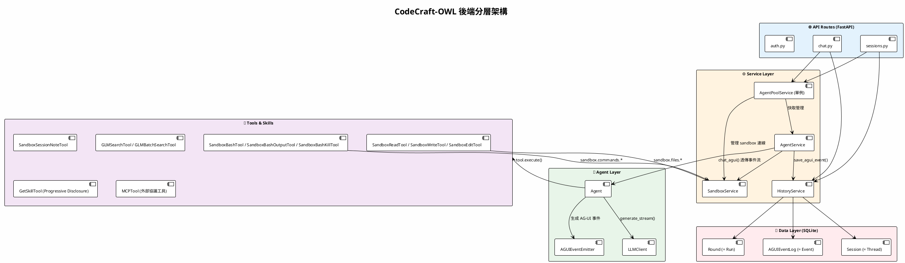
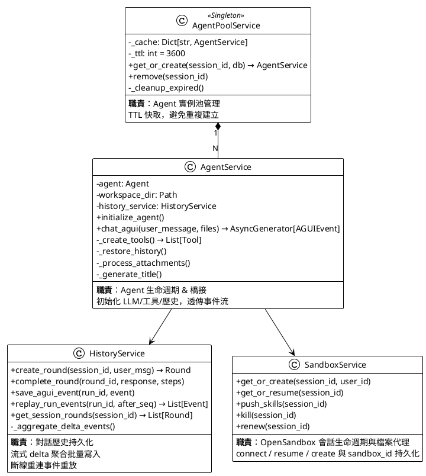
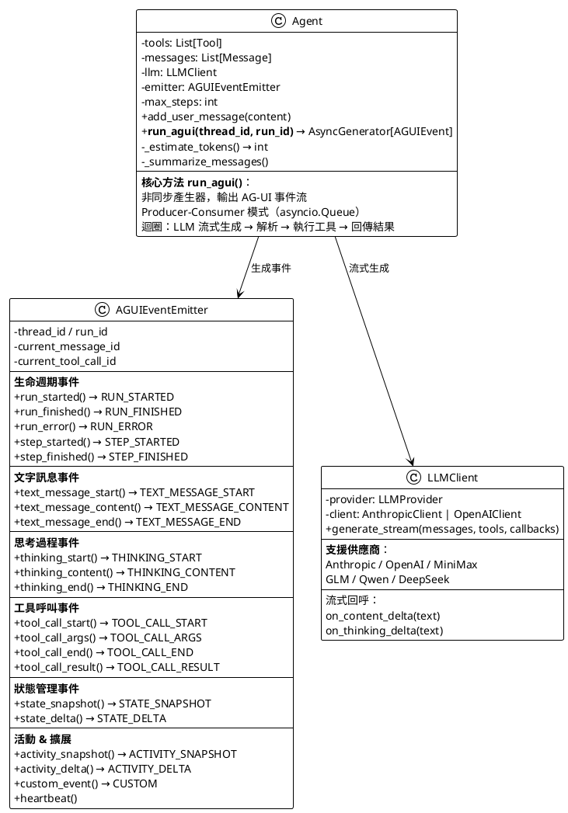

# CodeCraft-OWL 後端架構：Agent / Service 分工與 AG-UI 事件流

## 分層架構總覽



---

## 各層職責詳解

### 1. API Routes（路由層）

| 路由 | 端點 | 委託服務 | 說明 |
|------|------|---------|------|
| **chat.py** | `POST /{session_id}/message/stream` | `AgentPoolService` → `AgentService` | SSE 串流回傳 AG-UI 事件 |
| | `GET /{session_id}/round/{round_id}/subscribe` | `HistoryService` | 斷線重連：重放事件 + 即時推送 |
| **sessions.py** | `POST /create` | `AgentPoolService` | 預初始化 Agent |
| | `GET /list` | DB 直查 | 列出所有會話 |
| | `GET /{id}/history/v2` | `HistoryService` | 查詢對話歷史 |
| | `DELETE /{id}` | `AgentPoolService` + `SandboxService` | 清理 Agent + 關閉 sandbox |
| | `GET /{id}/files` | `SandboxService` | 列出 sandbox 會話檔案 |
| **auth.py** | `POST /login` / `GET /me` | 內建驗證 | 帳密驗證 |

> **核心原則**：Route 層只做 HTTP/SSE 協議轉換，**不做業務邏輯**，AG-UI 事件流由 Agent 層原生產生，Route 層直接透傳。

---

### 2. Service Layer（服務層）



---

### 3. Agent Layer（智能體核心層）



---

### 4. Tools & Skills（工具能力層）

| 工具 | 名稱 | 職責 |
|------|------|------|
| `SandboxReadTool` | read_file | 透過 `sandbox.files.read_file` 讀取沙箱檔案（含 token 截斷） |
| `SandboxWriteTool` | write_file | 透過 `sandbox.files.write_file` 寫入/建立沙箱檔案 |
| `SandboxEditTool` | edit_file | 透過字串替換精確編輯沙箱檔案片段 |
| `SandboxBashTool` | bash | 透過 `sandbox.commands.run` 執行指令（前台/背景） |
| `SandboxBashOutputTool` | bash_output | 取得 sandbox 背景進程輸出 |
| `SandboxBashKillTool` | bash_kill | 終止 sandbox 背景進程 |
| `SandboxSessionNoteTool` | record_note | 會話記憶（儲存於 sandbox） |
| `GLMSearchTool` | glm_search | 智譜 AI 網路搜尋 |
| `GLMBatchSearchTool` | glm_batch_search | 平行多查詢搜尋 |
| `GetSkillTool` | get_skill | Progressive Disclosure L2：按需載入技能 |
| `MCPTool` | 動態命名 | MCP 協議外部工具（stdio / HTTP） |

**技能 Progressive Disclosure 三層架構**：

```
Level 1: 技能元資料（名稱+描述）注入 system prompt → LLM 知道有哪些技能
Level 2: Agent 呼叫 get_skill(name) → 取得技能完整 SKILL.md 內容
Level 3: 技能內容中的腳本/資源路徑 → 自動轉為絕對路徑
```

---

### 5. Data Layer（資料層）

| 模型 | 表名 | AG-UI 對映 | 關鍵欄位 |
|------|------|-----------|---------|
| `Session` | sessions | **Thread** (threadId) | id, user_id, title, status, created_at |
| `Round` | rounds | **Run** (runId) | id, session_id, user_message, final_response, step_count, status, outcome |
| `AGUIEventLog` | agui_events | **BaseEvent** | run_id, event_type, message_id, tool_call_id, payload(JSON), sequence |

---

## 完整呼叫流程 & AG-UI 事件序列

```plantuml
@startuml
!theme plain
skinparam backgroundColor #FEFEFE

actor "前端 (React)" as Frontend
participant "chat.py\n(Route)" as Route
participant "AgentPoolService" as Pool
participant "AgentService" as ASvc
participant "HistoryService" as HSvc
participant "Agent" as Agent
participant "AGUIEventEmitter" as Emitter
participant "LLMClient" as LLM
participant "Tool" as Tool
database "SQLite" as DB

Frontend -> Route : POST /{session_id}/message/stream\n{message, files}
activate Route

Route -> Pool : get_or_create(session_id)
activate Pool

alt 快取未命中
    Pool -> ASvc ** : new AgentService()
    Pool -> ASvc : initialize_agent()
    activate ASvc
    ASvc -> LLM ** : 建立 LLMClient
    ASvc -> Tool ** : _create_tools()\n[Read/Write/Edit/Bash/Note/Search/Skill/MCP]
    ASvc -> HSvc : _restore_history()\n(精簡載入: user_msg + final_response)
    deactivate ASvc
end

Pool --> Route : AgentService
deactivate Pool

Route -> ASvc : chat_agui(user_message, files)
activate ASvc

ASvc -> HSvc : create_round()
HSvc -> DB : INSERT rounds
ASvc -> Agent : add_user_message()
ASvc -> Agent : run_agui(thread_id, run_id)
activate Agent

' === AG-UI 事件流開始 ===

Agent -> Emitter : run_started()
Emitter --> Route : 🟢 **RUN_STARTED**\n{type, thread_id, run_id}
Route --> Frontend : SSE: data: {RUN_STARTED}

Agent -> Emitter : state_snapshot()
Emitter --> Route : 📊 **STATE_SNAPSHOT**\n{snapshot: {currentStep, totalSteps, status}}
Route --> Frontend : SSE: data: {STATE_SNAPSHOT}

group 迴圈: step 1..max_steps [每個推理步驟]

    Agent -> Emitter : step_started()
    Emitter --> Route : 📋 **STEP_STARTED**\n{step_name: "step_1"}
    Route --> Frontend : SSE: data: {STEP_STARTED}

    Agent -> LLM : generate_stream(messages, tools)
    activate LLM

    alt 有思考內容 (Extended Thinking)
        LLM --> Agent : on_thinking_delta
        Agent -> Emitter : thinking_start()
        Emitter --> Route : 💭 **THINKING_START**\n{message_id}
        Route --> Frontend : SSE

        loop 每個 thinking token
            LLM --> Agent : on_thinking_delta(text)
            Agent -> Emitter : thinking_content(delta)
            Emitter --> Route : 💭 **THINKING_CONTENT**\n{delta: "..."}
            Route --> Frontend : SSE
        end

        Agent -> Emitter : thinking_end()
        Emitter --> Route : 💭 **THINKING_END**
        Route --> Frontend : SSE
    end

    Agent -> Emitter : text_message_start()
    Emitter --> Route : 💬 **TEXT_MESSAGE_START**\n{message_id, role: "assistant"}
    Route --> Frontend : SSE

    loop 每個 content token
        LLM --> Agent : on_content_delta(text)
        Agent -> Emitter : text_message_content(delta)
        Emitter --> Route : 💬 **TEXT_MESSAGE_CONTENT**\n{delta: "token..."}
        Route --> Frontend : SSE
    end

    deactivate LLM

    Agent -> Emitter : text_message_end()
    Emitter --> Route : 💬 **TEXT_MESSAGE_END**
    Route --> Frontend : SSE

    alt LLM 回應包含 tool_calls

        loop 每個 tool_call
            Agent -> Emitter : tool_call_start()
            Emitter --> Route : 🔧 **TOOL_CALL_START**\n{tool_call_id, tool_call_name}
            Route --> Frontend : SSE

            Agent -> Emitter : tool_call_args()
            Emitter --> Route : 🔧 **TOOL_CALL_ARGS**\n{delta: '{"param":"value"}'}
            Route --> Frontend : SSE

            Agent -> Emitter : tool_call_end()
            Emitter --> Route : 🔧 **TOOL_CALL_END**
            Route --> Frontend : SSE

            Agent -> Tool : execute(**args)
            activate Tool
            Tool --> Agent : ToolResult
            deactivate Tool

            Agent -> Emitter : tool_call_result()
            Emitter --> Route : 🔧 **TOOL_CALL_RESULT**\n{tool_call_id, content: "result..."}
            Route --> Frontend : SSE
        end

    else 無 tool_calls → 結束迴圈
    end

    Agent -> Emitter : step_finished()
    Emitter --> Route : 📋 **STEP_FINISHED**\n{step_name: "step_1"}
    Route --> Frontend : SSE

    Agent -> Emitter : state_delta()
    Emitter --> Route : 📊 **STATE_DELTA**\n{delta: [{op:"replace", path:"/currentStep", value:2}]}
    Route --> Frontend : SSE

end

' === 結束 ===

alt 正常完成
    Agent -> Emitter : run_finished()
    Emitter --> Route : 🟢 **RUN_FINISHED**\n{outcome: "success"}
    Route --> Frontend : SSE
else 中斷 (Human-in-the-Loop)
    Agent -> Emitter : run_finished(interrupt)
    Emitter --> Route : 🟡 **RUN_FINISHED**\n{outcome: "interrupt",\ninterrupt: {id, reason, payload}}
    Route --> Frontend : SSE
else 錯誤
    Agent -> Emitter : run_error()
    Emitter --> Route : 🔴 **RUN_ERROR**\n{message, code}
    Route --> Frontend : SSE
end

deactivate Agent

' === 事件持久化 ===
note over Route, HSvc
    **每個 AG-UI 事件同時做**：
    1. HistoryService.save_agui_event() → DB
       (delta 事件聚合後批量寫入)
    2. EventEncoder.encode() → SSE 串流
    3. _broadcast_to_subscribers() → 多客戶端
end note

ASvc -> HSvc : complete_round(round_id, response, steps)
HSvc -> DB : UPDATE rounds

deactivate ASvc
deactivate Route

== 斷線重連 ==

Frontend -> Route : GET /subscribe?lastSequence=N
Route -> HSvc : replay_run_events(run_id, after=N)
HSvc -> DB : SELECT * FROM agui_events\nWHERE sequence > N
HSvc --> Route : 歷史事件列表
Route --> Frontend : SSE: 重放歷史事件\n+ 繼續即時推送新事件

@enduml
```



---

## AG-UI 事件類型完整對照

### 事件在各層的流動

```
Agent.run_agui()  →  AGUIEventEmitter  →  AgentService.chat_agui()  →  chat.py (Route)  →  SSE → 前端
     (產生)              (封裝)              (透傳 + 持久化)             (編碼 + 廣播)
```

### 全部事件類型

| 分類 | 事件 | 產生位置 | 觸發時機 | 攜帶資料 |
|------|------|---------|---------|---------|
| **生命週期** | `RUN_STARTED` | `Agent.run_agui()` 開頭 | 每次 run 開始 | thread_id, run_id |
| | `RUN_FINISHED` | `Agent.run_agui()` 結尾 | run 成功完成/中斷 | outcome, interrupt? |
| | `RUN_ERROR` | `Agent.run_agui()` 異常 | run 出錯 | message, code |
| | `STEP_STARTED` | 每個推理步驟開始 | LLM 呼叫前 | step_name |
| | `STEP_FINISHED` | 每個推理步驟結束 | 工具執行後 | step_name |
| **文字訊息** | `TEXT_MESSAGE_START` | LLM 流式回呼 | 助手回覆開始 | message_id, role |
| | `TEXT_MESSAGE_CONTENT` | LLM on_content_delta | 每個 token 產生時 | delta (文字片段) |
| | `TEXT_MESSAGE_END` | LLM 回覆結束 | 助手回覆完成 | message_id |
| **思考過程** | `THINKING_START` | LLM 流式回呼 | Extended Thinking 開始 | message_id |
| | `THINKING_CONTENT` | LLM on_thinking_delta | 每個思考 token | delta |
| | `THINKING_END` | 思考結束 | Extended Thinking 完成 | — |
| **工具呼叫** | `TOOL_CALL_START` | 解析 LLM 回應 | 發現 tool_call | tool_call_id, tool_call_name |
| | `TOOL_CALL_ARGS` | 解析 LLM 回應 | 參數就緒 | delta (JSON 字串) |
| | `TOOL_CALL_END` | 參數解析完成 | 準備執行工具 | tool_call_id |
| | `TOOL_CALL_RESULT` | tool.execute() 後 | 工具執行完成 | tool_call_id, content |
| **狀態管理** | `STATE_SNAPSHOT` | run 開始時 | 初始化前端狀態 | snapshot (完整 JSON) |
| | `STATE_DELTA` | 每個 step 結束 | 更新進度 | delta (JSON Patch) |
| **活動** | `ACTIVITY_SNAPSHOT` | 按需 | 活動狀態完整快照 | activities |
| | `ACTIVITY_DELTA` | 按需 | 活動狀態增量更新 | delta (JSON Patch) |
| **擴展** | `CUSTOM` | 標題生成等 | 應用自定義場景 | name, value |

---

## Agent vs Service 分工總結

```
┌─────────────────────────────────────────────────────────────────────┐
│                        分工邊界                                      │
├─────────────────────────────┬───────────────────────────────────────┤
│       Agent 層 (負責)        │         Service 層 (負責)             │
├─────────────────────────────┼───────────────────────────────────────┤
│ ✅ LLM 交互迴圈              │ ✅ Agent 實例池化 (TTL 快取)           │
│ ✅ 工具選擇與執行             │ ✅ Agent 初始化 (LLM/工具/歷史)       │
│ ✅ AG-UI 事件流生成           │ ✅ 事件持久化 (聚合寫入 DB)           │
│ ✅ Token 估算與歷史壓縮       │ ✅ 對話歷史管理 (Round/Event CRUD)   │
│ ✅ System prompt 注入        │ ✅ 工作空間目錄管理 (symlink/cleanup) │
│ ✅ 多步推理控制 (max_steps)   │ ✅ 沙箱安全 (路徑/指令驗證)          │
│ ✅ Producer-Consumer 事件佇列│ ✅ 斷線重連 (事件重放)               │
│                             │ ✅ 附件處理                           │
│                             │ ✅ 標題自動生成                       │
└─────────────────────────────┴───────────────────────────────────────┘

核心設計原則：
→ Agent 層只關心 "AI 如何思考和行動"
→ Service 層只關心 "如何管理、持久化和保護 Agent"
→ Route 層只關心 "如何把事件流送給前端"
```
